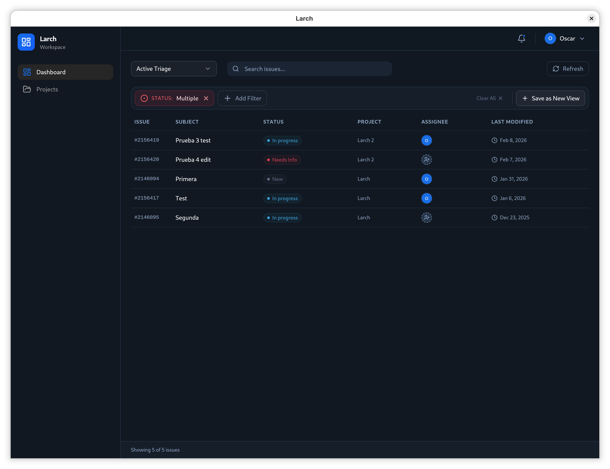
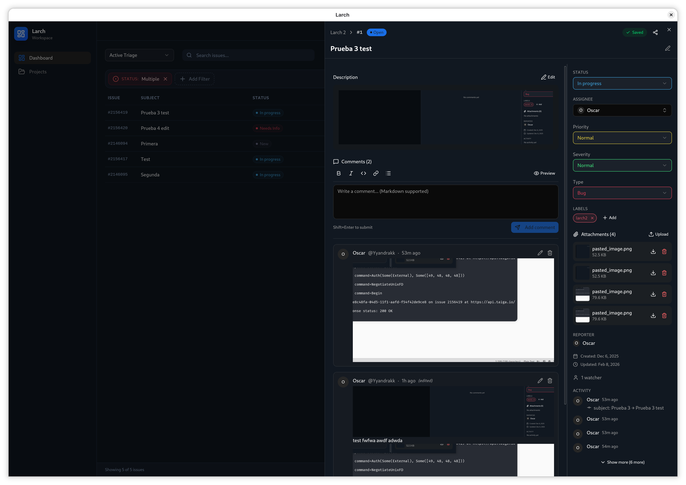
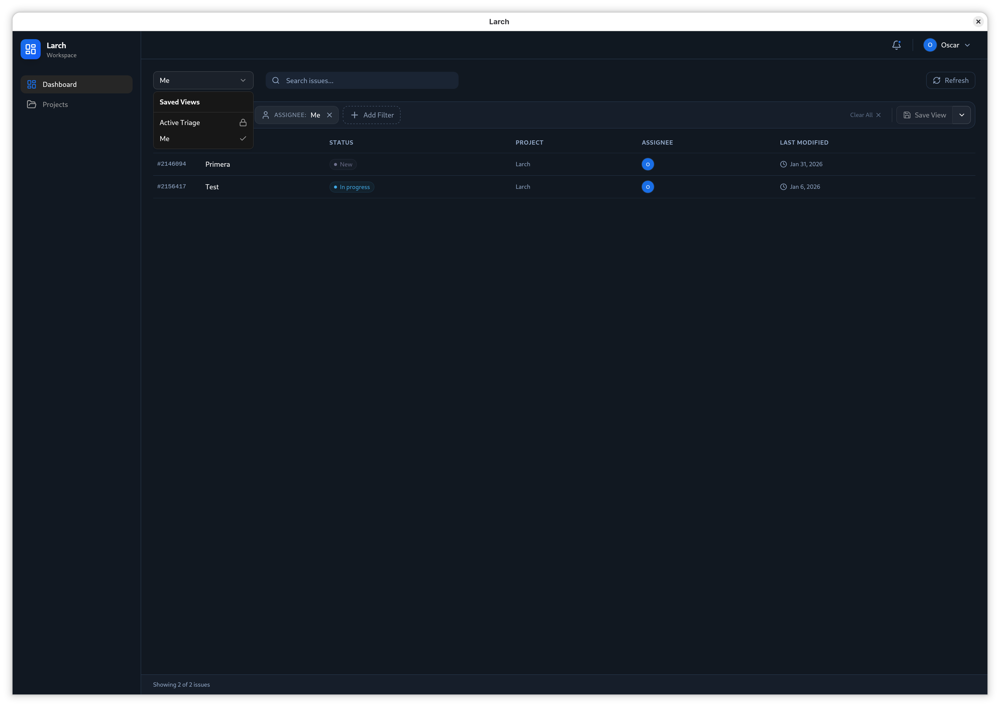
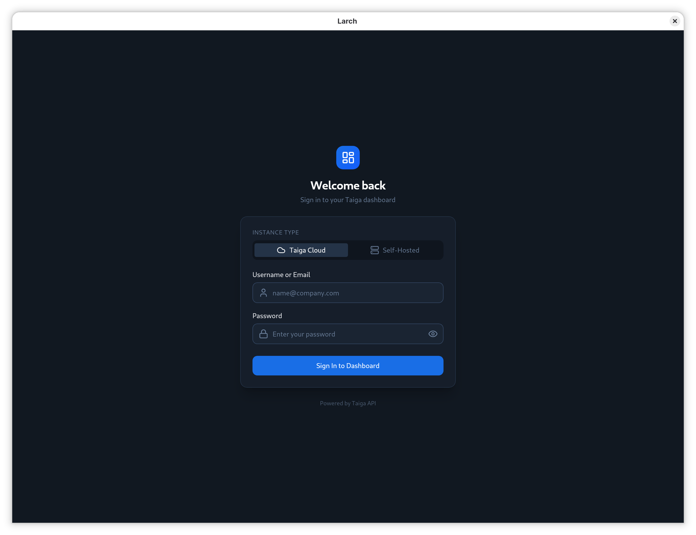

# Larch

[](https://opensource.org/licenses/MIT)
[](https://tauri.app/)
[](https://svelte.dev/)

**Larch** is a modern, cross-platform desktop client for [Taiga.io](https://taiga.io/), designed to streamline issue management across multiple projects. It acts as a "single pane of glass" for developers and managers who need to triage, track, and respond to issues without constantly switching context between different project URLs.



## ✨ Key Features (v2.1)

- **Unified Dashboard**: View and manage issues from multiple Taiga projects in a single, filterable interface.
- **Saved Views**: Define, persist, and switch between complex filter contexts instantly. Perfect for managing different workflows or clients.
- **Intelligent Triage**: Automatically filters for actionable issues by default, with a visual **Dirty State** indicator for unsaved filter changes.
- **Advanced Issue Management**: Two-column detail view for efficient editing, label management, attachments, and comment threading.
- **Security First**: API tokens are stored securely in your operating system's native keychain. Features automatic **JWT Refresh** for uninterrupted sessions.
- **Cross-Platform**: Native performance and look-and-feel on **Linux**, **Windows**, and **macOS**.

## 📸 Screenshots

|                        Dashboard Overview                        |                     Issue Detail                     |
| :--------------------------------------------------------------: | :--------------------------------------------------: |
|  |  |
|                         **Saved Views**                          |                   **Secure Login**                   |
|                |                |

## 🚀 Installation

Download the latest release for your operating system from the [Releases Page](../../releases).

### Linux

- **Debian/Ubuntu**: Download `.deb` and run `sudo dpkg -i larch_*.deb`.
- **Fedora/RHEL**: Download `.rpm` and run `sudo rpm -i larch_*.rpm`.
- **Universal**: Download `.AppImage`, make it executable (`chmod +x`), and run.

### Windows

- Download and run the `.msi` or `.exe` installer.

### macOS

- Download the `.dmg`, open it, and drag Larch to your Applications folder.

## 🛠️ Development

Larch is built with **Tauri v2**, **Rust**, and **Svelte 5**.

### Prerequisites

- [Rust](https://www.rust-lang.org/tools/install) (latest stable)
- [Node.js](https://nodejs.org/) (LTS) & [pnpm](https://pnpm.io/)
- System dependencies for Tauri (see [Tauri v2 Prerequisites](https://v2.tauri.app/start/prerequisites/))

### Setup

1. Clone the repository:
   ```bash
   git clone https://github.com/Yyandrakk/Larch.git
   cd Larch
   ```
2. Install dependencies:
   ```bash
   pnpm install
   ```
3. Run in development mode:
   ```bash
   just dev
   ```

### Useful Commands

We use `just` as a command runner:

- `just dev`: Run in development mode
- `just check`: Run all checks (clippy + svelte-check)
- `just test`: Run all tests
- `just format`: Format all code

## 🏗️ Architecture

Larch follows a **Clean Architecture** pattern to ensure maintainability and testability:

- **Frontend**: Svelte 5 (Runes) + TypeScript + TailwindCSS + shadcn-svelte.
- **Backend**: Rust (Tauri v2) with a dedicated `taiga-client` crate.
- **Data Layer**: SQLite with **SeaORM** for persistence and `keyring-rs` for secure credential storage.

For more details, see the [Architecture Documentation](./docs/architecture.md).

## 📄 License

This project is licensed under the **MIT License** - see the [LICENSE](LICENSE) file for details.
